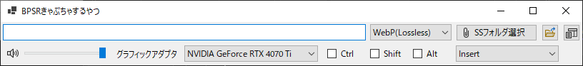
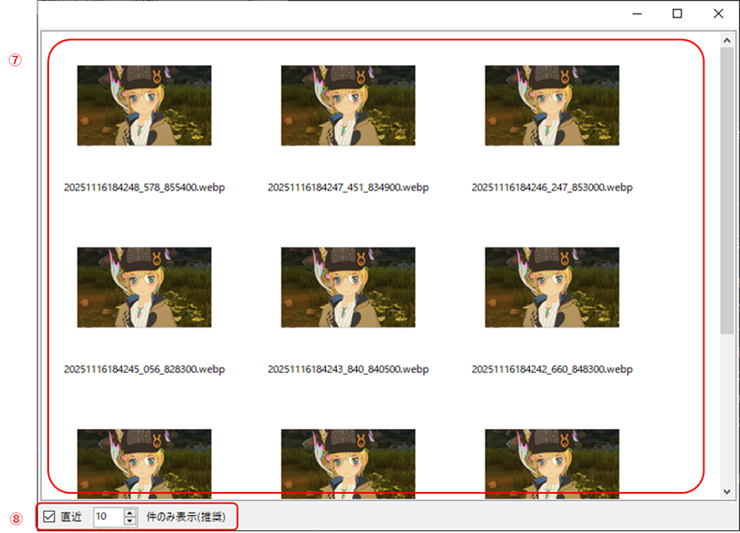
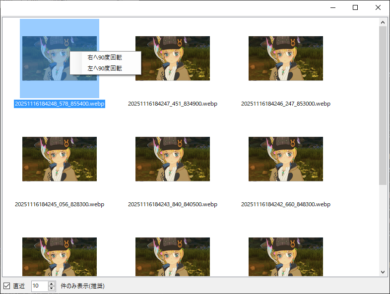
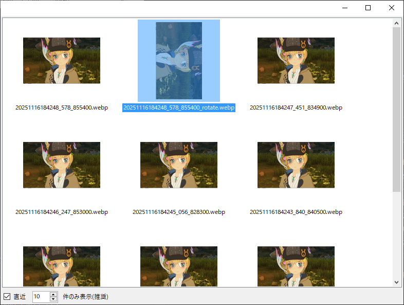

# 概要
## これは何？
ブループロトコル：スターレゾナンス 用のスクリーンショット撮影ツールです。
## 何ができる？
以下の機能があります。
* ゲーム内のフォトモードを介さず、設定したキーを押下することで、ワンタッチでスクリーンショットを撮影する。
* PNG形式以外のファイル形式でスクリーンショットを保存する\(PNG,JPEG,WebP,BMP に対応\)
* 撮影したスクリーンショットを左右90度回転させる。
## 動作環境
* Windows10 1809以降  
※Windows11は動作未検証ですが動くと思います。
* .NET Framework 9
# インストール
ダウンロードしたZipファイルを任意の場所へ解凍すればOKです。
# アンインストール
下記を削除してください。  
* \(任意のフォルダ\)\\BPSRCapture.exe  
* %AppData%\\BPSRCapture\\settings.config
# 操作説明
## UI
### メインウィンドウ
本ソフトウェアのメイン画面です。
  
① : スクリーンショットの保存フォルダとファイル形式を指定  
② : スクリーンショットの保存フォルダをエクスプローラーで開く  
③ : ビューワーウィンドウを開く  
④ : シャッター音の調節を行う\(スピーカーのアイコンをクリックするとミュートのON/OFFができます\)  
⑤ : 使用しているグラフィックアダプタを設定  
　　特に問題が無い限りは一番上を選択してください。撮影した画像が真っ黒になる場合は、適宜選択を切り替えてください。
⑥ : 撮影に使用するキーを指定。ゲーム内のキーアサインと被らないキーを設定してください。
### ビューワーウィンドウ
撮影した画像のリストを表示する画面です。
  
⑦ : 撮影した画像のサムネイルとファイル名を表示する領域です。  
　　サムネイルを右クリックすると、画像を回転させるためのメニューが出てきます。  
⑧ : 画像の表示件数を制限します。\(チェックボックスONで有効化。数値は制限件数\)  
　　サムネイルの表示は重いので、ONにしておくことをおすすめします。
#### ビューワーウィンドウでの画像回転
ビューワーウィンドウでは、サムネイルを右クリックすると、画像を回転させるためのメニューが表示されます。  
左右90度ずつ回転でき、回転した画像は \<元のファイル名_rotate.元の拡張子\>で保存されます。\(既に存在する場合は上書き\)
  
  
# 注意事項・免責事項
* 技術的問題により、デスクトップ領域からBPSRのクライアント領域を切り出すようにしています。
  BPSR以外のウィンドウが前面に出ている状態で撮影すると、その様子がそのまま撮影されてしまいますので、必ずBPSRをアクティブにした状態で撮影してください。
* このソフトウェアはギルド内で限定的に公開しているものです。ギルド外の第三者への再配布は原則禁止です。こっそりやっても黙認しますがサポートはしません。
* BPSRが正式サービス開始後、BPSRの利用規約で外部ツールの禁止が明言される、もしくはBPSRでインスタント撮影機能が実装された場合、このアプリは公開を停止する予定です。
* このソフトウェアを利用することによってユーザーが被るあらゆる不利益について、＠Floren_mabi は一切の責任を負いません。
* このソフトウェアはまともなエラー処理もテストも行っていない、いわゆる殴り書き状態でリリースしています。その点ご承知おきください。
* 不具合を見つけた場合Discord(EternalWindサーバー)にて報告して頂いて構いません。報告義務はありません。ただし、バグフィクスには時間がかかる場合があります。
